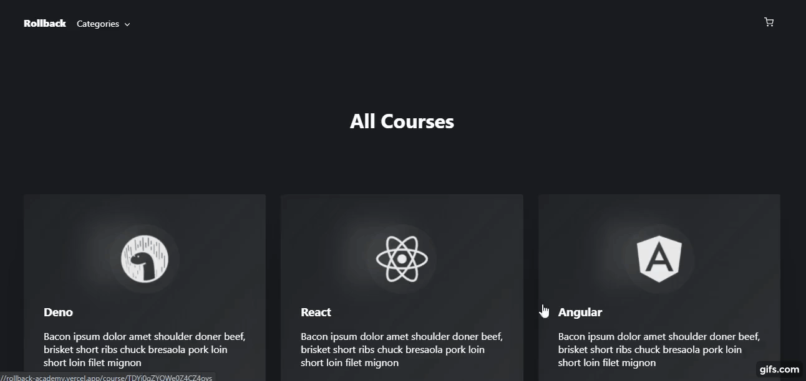

# Rollback Academy

El concepto detras de este proyecto es crear una tienda para comprar cursos online de programación, con enfasis en las bases y conceptos que sustenta la construcción e ingeniería del software.

:rocket: [Link al proyecto](https://rollback-academy.vercel.app/).

## Scripts

Para levantar en local, como todo proyetco de create-ract-app, se debe correr:

### `npm start`
